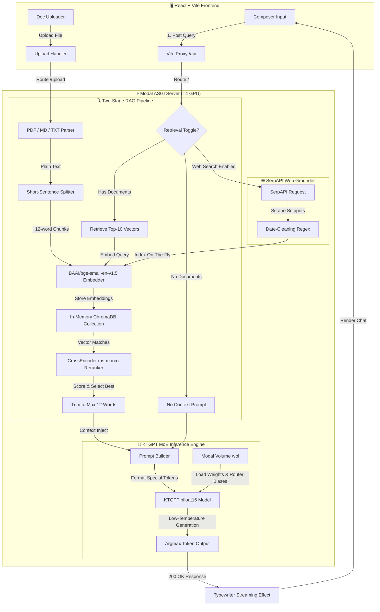

# 🌌 KTGPT: Sparkle Talk Forge ⚡

[](https://fastapi.tiangolo.com)
[](https://react.dev)
[](https://tailwindcss.com)
[](https://modal.com)
[](https://www.trychroma.com)
[](https://pytorch.org)

> **Sparkle Talk Forge (KTGPT Chat)** is a state-of-the-art, context-grounded LLM chat platform. Driven by a custom-trained **Mixture of Experts (MoE)** model, it integrates an advanced, sentence-level **Retrieval-Augmented Generation (RAG)** pipeline and real-time **Web Search** grounders to deliver lightning-fast, zero-hallucination responses.

---

## 🧭 System Architecture & Data Flow

Below is the complete architectural layout of KTGPT. It describes how user prompts, document uploads, and web searches flow between the **Vite + React Client**, the **FastAPI ASGI Serverless Layer (Modal)**, the **ChromaDB Vector Pipeline**, and the **KTGPT MoE Model**.



---

## 🔥 Key Technical Highlights

### 1. Custom Mixture of Experts (MoE) Architecture
* **Expert Routing Biases:** Loads custom pre-trained expert router biases directly into the transformer layers from the serverless checkpoint.
* **Low-Latency Inference:** Deployed in `torch.bfloat16` precision on an **NVIDIA T4 GPU** inside serverless container environments on Modal.
* **Special Token Schemas:** Fully aligned with ChatML-inspired format tags:
  ```text
  <|system|>
  You are KTGPT, a helpful assistant made by Mindrix.
  ...
  <|end|>
  <|user|>
  Context: [Retrieved Segment]
  Question: [User Question]
  <|end|>
  <|assistant|>
  [Model Response]
  ```

### 2. High-Precision Short-Context RAG (Phase 1.5 Calibrated)
* **Short-Sentence Splitter:** Most RAG systems use large chunks (512+ tokens), which invite LLM hallucinations. KTGPT utilizes a custom text processing formula that splits files into sentences of **~10-15 words**.
* **Precise 12-Word Constraint:** To ensure strict context-grounded exact copy-stop retrieval, retrieved segments are carefully trimmed to exactly **12 words** and ended with a clean punctuation boundary (`.!?`), aligning perfectly with KTGPT's grounding pre-training format.

### 3. Neural Double-Retrieval Pipeline
* **Dense Retrieval:** Encodes the parsed document sentences on-the-fly using `BAAI/bge-small-en-v1.5` embeddings, inserting them into an in-memory `hnsw:space: cosine` ChromaDB collection.
* **Cross-Encoder Reranking:** Computes semantic relevance scores for the top-10 retrieved vector matches against the user question using `cross-encoder/ms-marco-MiniLM-L-6-v2` to select the single absolute best grounding sentence.

### 4. SerpAPI Web Grounder
* When **Web Search** is activated, the server scrapes live organic Google Search results on-the-fly.
* Cleans noisy metadata date-patterns (e.g., `Jan 12, 2026 ...`) utilizing robust regular expressions, splits and indexes them inside ChromaDB, and passes the most relevant search snippet as the grounding context.

---

## 📂 Project Directory Structure

```text
ktgpt_chat/
├── backend/
│   └── server.py             # FastAPI app, ChromaDB Retriever, & Modal serverless config
├── frontend/
│   ├── src/
│   │   ├── components/       # UI Elements (Composer, MessageBubble, Welcome)
│   │   ├── pages/
│   │   │   └── Index.tsx     # Main chat application page and API bridge
│   │   ├── lib/              # Theme, Typewriter utility, Types, & Mock handlers
│   │   ├── index.css         # Styling system & custom dark/light theme tokens
│   │   └── main.tsx          # React application root entry
│   ├── vite.config.ts        # Vite configuration & development server proxy
│   └── package.json          # Frontend packages & script definitions
├── main.py                   # Root runner
├── pyproject.toml            # Python backend dependencies
└── README.md                 # Interactive Documentation
```

---

## 🔌 API Endpoint Specifications

All endpoints are hosted dynamically under the ASGI serverless container on Modal.

| Endpoint | Method | Description | Payload Schema | Response Schema |
| :--- | :--- | :--- | :--- | :--- |
| `/` | `POST` | Core Chat & retrieval | `{"question": str, "context": str, "use_retrieval": bool, "use_web_search": bool}` | `{"response": str, "source": str}` |
| `/upload` | `POST` | Index TXT, MD, or PDF | `Multipart Form: file` | `{"filename": str, "sentences": int, "status": "indexed"}` |
| `/stats` | `GET` | Get ChromaDB volume size | *None* | `{"documents": int, "sentences": int}` |
| `/clear` | `POST` | Purge vector store | *None* | `{"status": "cleared"}` |

---

## 🚀 Deployment & Installation Guide

### 🛠️ Backend Deployment (Modal Serverless)

The backend runs entirely serverless, scaling up to dedicated **NVIDIA T4 GPUs** when active, and scale-to-zero when idle.

#### 1. Pre-requisites & Secrets
Make sure you have a [Modal account](https://modal.com) and the `modal` CLI installed and authenticated:
```bash
pip install modal
modal setup
```

You must configure two Secrets in your Modal dashboard:
* **`hf-secret`**: Containing your HuggingFace Token (if pulling restricted models).
* **`serpapi`**: Containing your `SERPAPI_KEY` for live search groundings.

#### 2. Run / Deploy
Run the server interactively for testing:
```bash
modal run backend/server.py
```
Or deploy it permanently as an ASGI endpoint:
```bash
modal deploy backend/server.py
```

---

### 💻 Frontend Client Setup (Vite + React)

The frontend is built on **React 18, Vite, Tailwind CSS, Lucide Icons, and shadcn/ui**.

#### 1. Install Dependencies
Navigate to the frontend directory and install the packages using `npm` or `bun`:
```bash
cd frontend
npm install
# OR
bun install
```

#### 2. Configure Local Development Proxy
Make sure your [vite.config.ts](file:///c:/Projects/ktgpt_chat/frontend/vite.config.ts) is forwarding `/api` calls to your live Modal deployment:
```typescript
server: {
  proxy: {
    "/api": {
      target: "YOUR_MODAL_APP_DEPLOYED_URL",
      changeOrigin: true,
      rewrite: (path) => path.replace(/^\/api/, ""),
    },
  },
}
```

#### 3. Spin Up Development Server
```bash
npm run dev
# OR
bun dev
```
Open your browser to `http://localhost:5173` and start chatting!

---

## 🎨 Interactive Interface Overview

| Feature | Description | Screen Element |
| :--- | :--- | :--- |
| **💡 Quick-Start Prompts** | Instant prompts to test the grounding quality on-the-fly. | Welcome Screen |
| **📁 Drag-and-Drop Indexer** | Drag and drop any TXT, MD, or PDF. Indexes sentences in <150ms. | Composer / Welcome |
| **🌐 Web-Search Grounder** | Toggle on-the-fly Google Search integrations. | Composer Toggle |
| **🌓 Ergonomic Themes** | One-click transitions between Sleek Dark Mode and Vibrant Light Mode. | Header Toggle |

---

 Empowering context-grounded AI intelligence.
