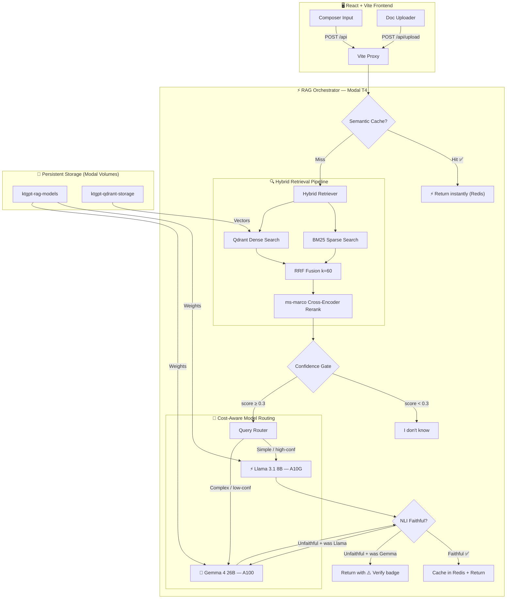
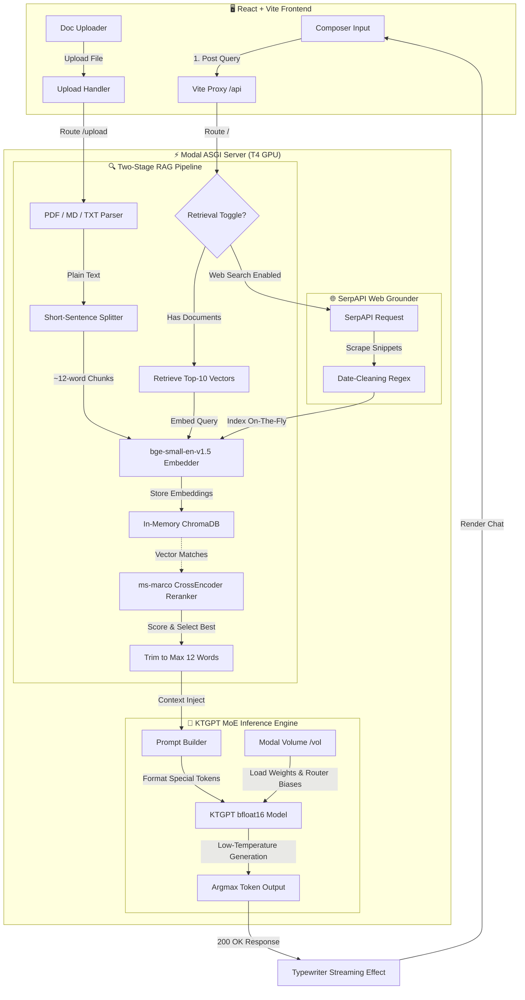

# 🌌 KTGPT: Sparkle Talk Forge ⚡

[](https://fastapi.tiangolo.com)
[](https://react.dev)
[](https://tailwindcss.com)
[](https://modal.com)
[](https://qdrant.tech)
[](https://pytorch.org)
[](https://vllm.ai)
[](https://redis.io)

> **Sparkle Talk Forge (KTGPT Chat)** is a production-grade, context-grounded LLM chat platform. Powered by a **cost-aware dual-model inference engine** (Gemma 4 26B + Llama 3.1 8B via vLLM), it combines **hybrid BM25 + dense vector retrieval**, **semantic query caching**, and **NLI faithfulness verification** to deliver fast, accurate, hallucination-resistant responses.

---

## 🆚 v1 → v2: What Changed

| Capability | v1 (KTGPT MoE) | v2 (Production RAG) |
| :--- | :--- | :--- |
| **Inference Model** | Custom KTGPT MoE (T4) | Gemma 4 26B + Llama 3.1 8B via vLLM |
| **Embeddings** | `bge-small-en-v1.5` | `multilingual-e5-large` |
| **Chunking** | Fixed ~12-word splits | Semantic similarity breakpoints |
| **Retrieval** | Dense only (ChromaDB) | Hybrid BM25 + Qdrant → RRF → Rerank |
| **Deduplication** | None | MinHash (Jaccard ≥ 0.8) |
| **Hallucination control** | Reranker score only | Confidence gate + NLI faithfulness |
| **Model routing** | Single model | Cost-aware: fast ↔ powerful tier |
| **Query caching** | None | Redis semantic cache (cosine sim ≥ 0.95) |
| **Vector store** | In-memory ChromaDB | Qdrant (persisted Modal Volume) |

> The original v1 `server.py` is preserved as-is and can be restored in one line of `vite.config.ts`.

---

## 🧭 v2 System Architecture



---

## 🧭 v1 Architecture (Legacy — server.py)

The original pipeline is preserved for reference:



---

## 🔥 Key Technical Highlights

### v2: Production RAG System

#### 1. Semantic Chunking (`chunker.py`)
- Embeds every sentence with `multilingual-e5-large` and computes cosine similarity between consecutive sentences
- Splits into new chunks at **similarity drop-off points** (threshold `0.5`) rather than fixed token counts
- **MinHash deduplication** via `datasketch` removes near-duplicate chunks (Jaccard ≥ 0.8) before indexing — avoids bloating the vector store with boilerplate text

#### 2. Hybrid Retrieval with RRF (`retriever.py`)
- **Dense:** `multilingual-e5-large` embeddings in **Qdrant** (persisted Modal Volume) with `"passage: "` / `"query: "` prefixes
- **Sparse:** `rank_bm25` BM25Okapi in-memory index rebuilt incrementally as docs are uploaded
- **RRF Fusion** (`k=60`): merges ranked lists by position — immune to cross-scale score normalization problems
- **Cross-encoder reranking:** `ms-marco-MiniLM-L-6-v2` re-scores the top-20 fused results for final precision

#### 3. Hallucination Control (`hallucination.py`)
- **Confidence gate:** If the top reranker score is `< 0.3`, the server refuses to answer rather than hallucinating
- **NLI faithfulness:** `cross-encoder/nli-deberta-v3-base` classifies whether the generated response is *entailed*, *neutral*, or *contradicted* by the retrieved context
- **Escalation:** If the fast model's response is contradicted, the request is automatically re-run through the big model

#### 4. Cost-Aware Routing (`router.py`)
- Routes queries between two tiers based on query length, complexity keywords (`"compare"`, `"analyze"`, `"evaluate"`...), retrieval confidence, and chunk count
- **Llama 3.1 8B** on A10G → simple/factual queries with high-confidence context
- **Gemma 4 26B** on A100 → complex/analytical queries or low-confidence scenarios

#### 5. Redis Semantic Cache (`cache.py`)
- Embeds each query with `multilingual-e5-large` and computes cosine similarity against all cached query embeddings
- Similarity ≥ `0.95` → cache hit → instant response, zero inference cost
- **TTL**: 1 hour default. **LRU eviction** at 1,000 entries max

### v1: Custom KTGPT MoE (preserved in `server.py`)
- **Expert Routing Biases:** Custom pre-trained biases loaded into transformer layers at inference time
- **Short-Context RAG:** ~12-word sentence-level chunks aligned with KTGPT's grounding pre-training format
- **Cross-Encoder Reranking:** Top-10 ChromaDB results reranked with `ms-marco-MiniLM-L-6-v2`
- **SerpAPI Web Grounder:** Live Google Search snippets indexed on-the-fly

---

## 📂 Project Directory Structure

```text
ktgpt_chat/
├── backend/
│   ├── rag_server.py         # [v2] Main orchestrator — Modal app, FastAPI routes
│   ├── chunker.py            # [v2] Semantic chunking + MinHash dedup
│   ├── retriever.py          # [v2] Hybrid BM25 + Qdrant + RRF + rerank
│   ├── hallucination.py      # [v2] Confidence gate + NLI faithfulness
│   ├── router.py             # [v2] Cost-aware Llama ↔ Gemma routing
│   ├── cache.py              # [v2] Redis semantic query cache
│   ├── models.py             # [v2] Pydantic API schemas
│   ├── prompts.py            # [v2] Llama 3.1 + Gemma 4 prompt formatters
│   ├── download_weights.py   # [v2] One-time Modal weight download script
│   └── server.py             # [v1] Original KTGPT MoE server (preserved)
├── frontend/
│   ├── src/
│   │   ├── components/
│   │   │   ├── chat/
│   │   │   │   ├── MessageBubble.tsx   # Model badge, confidence bar, cache/NLI indicators
│   │   │   │   ├── Composer.tsx        # File upload, web search toggle
│   │   │   │   └── Welcome.tsx         # Greeting + quick-start prompts
│   │   ├── pages/
│   │   │   └── Index.tsx       # Main chat page + API bridge
│   │   ├── lib/
│   │   │   ├── chatTypes.ts    # Message types (+ modelUsed, confidence, faithful, cached)
│   │   │   ├── theme.ts        # Dark/light theme
│   │   │   └── mockLlm.ts      # Typewriter streaming utility
│   │   ├── index.css           # Design system & theme tokens
│   │   └── main.tsx            # React entry
│   ├── vite.config.ts          # Proxy → v2 rag_server (v1 URL commented)
│   └── package.json
├── pyproject.toml              # Python deps (v2)
└── README.md
```

---

## 🔌 API Endpoint Specifications

### v2 — RAG Server (`rag_server.py`)

| Endpoint | Method | Description | Request | Response |
| :--- | :--- | :--- | :--- | :--- |
| `/` | `POST` | Full RAG pipeline chat | `{question, context?, use_retrieval?, use_web_search?}` | `{response, source, model_used, confidence, faithful, cached}` |
| `/upload` | `POST` | Index document (TXT/MD/PDF) | `Multipart: file` | `{filename, chunks, status, dedup_removed}` |
| `/stats` | `GET` | Index + cache statistics | — | `{documents, chunks, bm25_terms, cache_entries}` |
| `/clear` | `POST` | Clear all indices + cache | — | `{status: "cleared"}` |
| `/health` | `GET` | System health check | — | `{status, models_loaded, qdrant_connected, redis_connected}` |

### v1 — KTGPT Server (`server.py`)

| Endpoint | Method | Description | Payload | Response |
| :--- | :--- | :--- | :--- | :--- |
| `/` | `POST` | Chat with KTGPT MoE | `{question, context, use_retrieval, use_web_search}` | `{response, source}` |
| `/upload` | `POST` | Index TXT, MD, or PDF | `Multipart Form: file` | `{filename, sentences, status}` |
| `/stats` | `GET` | ChromaDB volume size | — | `{documents, sentences}` |
| `/clear` | `POST` | Purge vector store | — | `{status: "cleared"}` |

---

## 🚀 Deployment & Installation Guide

### 🛠️ Backend — v2 RAG Server

#### Step 1: Pre-requisites

```bash
pip install modal
modal setup
```

#### Step 2: Create Modal Secrets

In your [Modal Secrets dashboard](https://modal.com/secrets):

| Secret Name | Key | Value |
| :--- | :--- | :--- |
| `hf-secret` | `HF_TOKEN` | HuggingFace token (needs Gemma 4 + Llama 3.1 access) |
| `serpapi` | `SERPAPI_KEY` | SerpAPI key for web search |
| `redis-secret` | `REDIS_URL` | Upstash Redis URL (`rediss://...`) |

#### Step 3: Download All Model Weights (one-time, ~45 min)

```bash
modal run backend/download_weights.py
```

Downloads to the `ktgpt-rag-models` Modal Volume:
- `google/gemma-4-26B-A4B-it` — ~50 GB → A100 GPU
- `meta-llama/Llama-3.1-8B-Instruct` — ~16 GB → A10G GPU
- `intfloat/multilingual-e5-large` — ~560 MB (embeddings)
- `cross-encoder/ms-marco-MiniLM-L-6-v2` — ~67 MB (reranker)
- `cross-encoder/nli-deberta-v3-base` — ~180 MB (faithfulness)

#### Step 4: Deploy

```bash
# Test interactively
modal serve backend/rag_server.py

# Deploy permanently
modal deploy backend/rag_server.py
```

---

### 🛠️ Backend — v1 KTGPT (Legacy)

```bash
# Requires hf-secret + serpapi secrets
modal run backend/server.py
modal deploy backend/server.py
```

---

### 💻 Frontend Client (Vite + React)

#### Install

```bash
cd frontend
npm install   # or: bun install
```

#### Configure Proxy

In `vite.config.ts`, the proxy target is already set to the v2 deployment URL. After deploying, update it with your actual Modal URL:

```typescript
proxy: {
  "/api": {
    // v2 RAG Server
    target: "https://<your-modal-user>--ktgpt-rag-server-ragserver-serve.modal.run",
    // v1 KTGPT (legacy fallback)
    // target: "https://<your-modal-user>--ktgpt-server-ktgptserver-serve-dev.modal.run",
    changeOrigin: true,
    rewrite: (path) => path.replace(/^\/api/, ""),
  },
},
```

#### Run

```bash
npm run dev   # or: bun dev
```

Open `http://localhost:8080` and start chatting.

---

## 🎨 Interface Overview

| Feature | Description | Element |
| :--- | :--- | :--- |
| **⚡ / 🧠 Model Badge** | Shows whether Llama 3.1 8B or Gemma 4 26B handled the query | Message metadata row |
| **▓▓▒░ Confidence Bar** | Retrieval reranker confidence (0–100%) | Message metadata row |
| **🔖 Cached** | Response served from Redis semantic cache | Message metadata row |
| **⚠️ Verify** | NLI check flagged a possible faithfulness issue | Message metadata row |
| **💡 Quick-Start Prompts** | Instant prompts to test grounding quality | Welcome Screen |
| **📁 File Indexer** | Upload any TXT, MD, or PDF — indexed with semantic chunking | Composer |
| **🌐 Web-Search Grounder** | Toggle live Google Search context via SerpAPI | Composer Toggle |
| **🌓 Theme Toggle** | One-click dark / light mode | Header |

---

 Empowering context-grounded AI intelligence — from demo to production.
